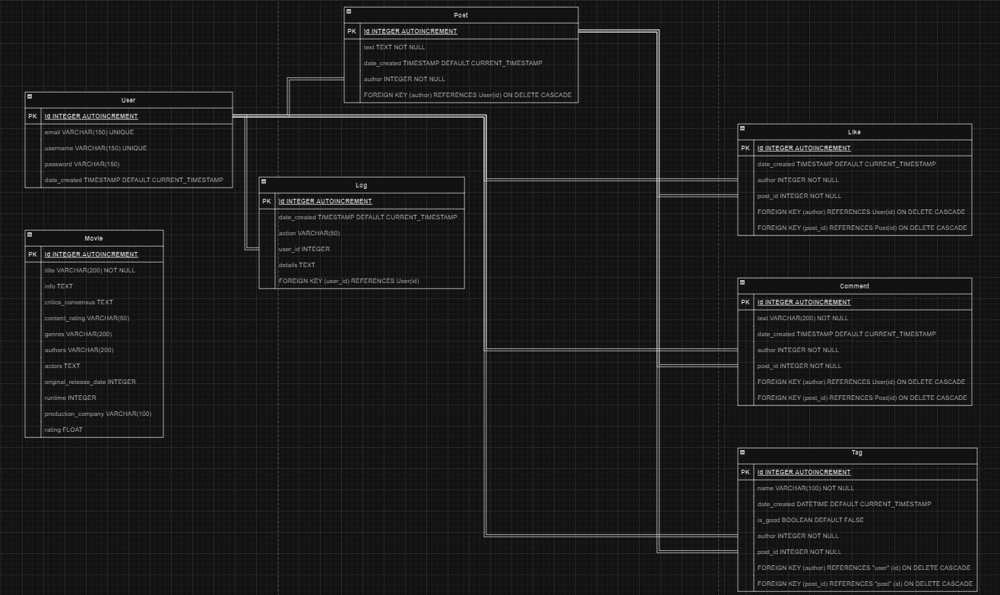

# Movie Recommendation Service

Welcome! This service enhances the experience for movie enthusiasts by providing robust and innovative tools for film recommendations. Let’s dive into the details!

<br>

## **Project Idea**
The core idea of this project is to improve the quality of movie recommendation searches.

<br>

## **Features Provided to Users**

### 1. Registration
Users can choose their preferred registration method:
- **Via Google Email:** A simple and familiar option for many users.
- **Full Registration (Sign-Up):** Users can register using any email. A confirmation code will be sent to their email, which they need to verify on the website.

### 2. Login
Registered users can log in using their email and password or via the Google service, depending on their chosen registration method.

### 3. Reviews (Posts)
Users can share their thoughts and recommendations:
- **Create Posts:** Users can write posts with relevant tags.
- **Like Posts:** Quality recommendations can be promoted by liking posts.
- **Comment:** Users can leave comments on posts.

### 4. Tagging System
Every post must include a tag. Tags help other users find recommendations for specific movies or actors, provided posts with such tags exist. There is also a tag sorting feature that allows users to distinguish whether tags are related to the movie theme or not.

(**Green** indicates correct items, **red** indicates incorrect ones)

### 5. Platform Recommendation System
The service provides a dedicated recommendation system:
1. **Choose a Criterion:** Users start by selecting a criterion for recommendations.
2. **Follow Guidance:** Users create their "wishlist" following on-site prompts.
3. **Receive Recommendations:** A curated list of recommended movies, complete with posters and essential information, is presented to the user.

### 6. Error Notifications
If an error occurs while using the website, users will be notified via a pop-up window with details about the error type.

### 7. Logging
Logs are used to track all user actions on the website. They are stored in the database. In case of an error, it will be possible to trace user actions and address service issues.

<br>

## **Running the Service**

### Required Applications
To run the service, you will need the following tools:
- Docker
- Docker Compose
- Git

### Steps to Launch

1. **Clone the Project:**

   First, clone the project repository using the following command:
   ```bash
   git clone git@github.com:PletkaDaniil/WEB_Project.git
   ```

2. **Build and Start the Containers:**

   Next, build and start the containers using:
   ```bash
   docker-compose up --build app
   ```

### Other Steps

3. **Shut Down Containers:**

   To stop the containers, use:
   ```bash
   docker-compose down
   ```

4. **Start the Application again:**

   After building the containers, to start the application, run:
   ```bash
   docker-compose up app
   ```
* **Tests:**

   After building the containers, to start tests, run:
   ```bash
      docker-compose run tests
   ```
---
<br>


## **XML**

To view the technical specification formatted in XML, go to the `dtd` folder and open it in your browser, or [use a link](https://codebeautify.org/xmlviewer) with better visualization (simply insert the [technical_specification.xml](dtd/technical_specification.xml) file there).

---

<br>

## **ER Diagram**

The diagram is implemented in the [Diagram.drawio](Diagram.drawio).

To view it, open the [Draw.io](https://www.drawio.com/) website and insert the file.



---


<br>

## Project Explanation

1.  **How to set up the poster functionality?**

You need to visit [the website](https://www.omdbapi.com). Select "API Key" from the top menu and complete the registration process.


After registration, you will receive an email containing the API key. Insert this key into the [user_server.json](app/website/user_server.json) file.

```bash
   {
    "user":{
            ...
            "api_key": "your_key"
        }
   }
```

---

2.  **How to log in using Google Mail?**

Here’s [an example guide](https://www.youtube.com/watch?v=FKgJEfrhU1E&t=392s) on how to complete all the steps in Google Cloud and obtain a [client_secret.json](app/website/client_secret.json)  file as a result:

```bash
   {
    "web":{
        "client_id":"",
        "project_id":"",
        "auth_uri":"",
        "token_uri":"",
        "auth_provider_x509_cert_url":"",
        "client_secret":"",
        "redirect_uris":[""]
      }
   }
```
---

3.  **How to send a confirmation code to any email in the sign_up section?**

First, choose the Google account to which you will link this functionality.
Enable two-factor authentication on your account.
Then, go to the App Passwords section and generate your app password.


Update the [user_server.json](app/website/user_server.json) file with your information.

```bash
   {
    "user":
        {
            "MAIL_USERNAME": "your_email@gmail.com",
            "MAIL_PASSWORD": "your_password",
            "MAIL_DEFAULT_SENDER": "your_email@gmail.com",
            ...
        }
   }
```

---

<br>

## **API**

1. `/home  (GET)`

**Purpose**: Displays the home page with posts sorted by the number of likes. **Available only to logged-in users**.

2. `/login (GET, POST)`

**Purpose**: Handles user login.

**POST**: Takes user email and password, authenticates the user, and logs them in.

**GET**: Renders the login page.

3. `/login/google (GET)`

**Purpose**: Redirects the user to Google’s OAuth login page.

**Flow**: Initiates the Google OAuth flow and stores the session state.

4. `/callback (GET)`

**Purpose**: Handles the Google OAuth callback.

**Flow**: Verifies the user's ID token, checks if the user exists in the database, and logs them in (or creates a new user).

5. `/logout (GET)`

**Purpose**: Logs the current user out.

**Flow**: Ends the user session and redirects to the home page.

6. `/sign-up (GET, POST)`

**Purpose**: Handles user registration.

**POST**: Takes user email, username, and password. Validates input, checks if the email or username already exists, and sends a confirmation email with a code.

**GET**: Renders the signup page.

7. `/confirm-email (GET, POST)`

**Purpose**: Verifies the confirmation code sent to the user’s email during registration.

**POST**: Takes the confirmation code entered by the user, verifies it, and completes the user registration if correct.

**GET**: Renders the confirmation page.

8. `/create-post (GET, POST)`

**Purpose**: Allows users to create a new post.

**POST**: Accepts the text and tags for the post, validates the input, and classifies the tags as "good" or "bad". Creates the post in the database with the associated tags and displays a success message. Available only to logged-in users.

**GET**: Renders the page to create a new post. Available only to logged-in users.

9. `/delete-post/<id>  (GET)`

**Purpose**: Allows users to delete their post.

**Flow**: Deletes the specified post along with its associated tags, comments, and likes if the user is the author of the post. Displays an error message if the user does not have permission to delete the post. Available only to the post author.

10. `/posts/<username> (GET)`

**Purpose**: Displays posts of a specific user.

**Flow**: Fetches posts of the given user, sorts them by the number of likes, and displays them. Displays an error message if the user does not exist. Available only to logged-in users.

11. `/tags/<tag_name> (GET)`

**Purpose**: Displays posts associated with a specific tag.

**Flow**: Fetches posts related to the given tag and sorts them by the number of likes. If no posts are found for the tag, it shows a message indicating there are no posts. Available only to logged-in users.

12. `/create-comment/<post_id> (POST)`

**Purpose**: Allows users to create a comment on a post.

**Flow**: Accepts text for the comment, validates it, and associates it with the post. Displays an error message if the comment is empty. Available only to logged-in users.


12. `/delete-comment/<comment_id>  (GET)`

**Purpose**: Allows users to delete their comment or a comment on their own post.

**Flow**: Deletes the comment if the user is the author of the comment or the post. Displays an error message if the user does not have permission to delete the comment. Available only to logged-in users.

13. `/like-post/<post_id> (POST)`

**Purpose**: Allows users to like or unlike a post.

**Flow**: Toggles the like status of the post. Updates the number of likes and the like status dynamically. Available only to logged-in users.

14. `/recommendations-system (GET, POST)`

**Purpose**: Allows users to get movie recommendations based on selected criteria.

**POST**: Accepts the selected criterion (e.g., genre, rating, actor) and user input. Calls the corresponding recommendation function to fetch movie recommendations, and returns the results with detailed movie information. Available only to logged-in users.

**GET**: Renders the page where users can select a criterion for movie recommendations. Available only to logged-in users.


---

<br>

This project is designed to provide a seamless and interactive movie recommendation experience for all users. Enjoy exploring and discovering great films!